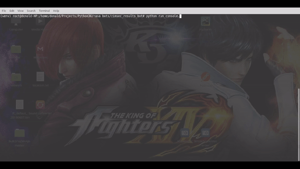
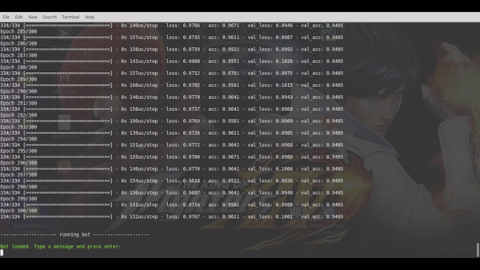

## Zimsec results facebook Bot
- This bot is not affiliated with Zimsec or the Ministry of Education whatsoever
- Its simply a proof of concept of what i had in mind after seeing many complaints about the zimsec results website issues
- A showcase of what can be used in the future or using AI to ease access to students results

### What it does
- Sign up / Register for first time students
- Login to view results
- Handle forgot password
- Prompt to print out results to downloadable file

### Functions
- `build_domain.py` automatically build a `domain.yml` file for you
- `build_train.py` automatically build a `train.md` file for you
- After installing all the dependencies
- run `nlu_model.py`
- run `train_init.py` to initialize training of the bot
- run ``train_online.py` to do interactive training online and auto generate stories data as `stories.md`
- run command line bot interface by running `run_console.py`

### Link bot to your FB page
- Refer to [rasa website](https://legacy-docs.rasa.com/docs/core/0.9.8/connectors/#facebook-messenger-setup) , needs a facebook developers account
- [facebook developer acc](https://developers.facebook.com/)
- use ngrok for local testing

### Demos
- register >>> CMD channel

- login >>> CMD channel


- On FB Messenger


### Technologies used
```buildoutcfg
powered by: Python v3.6
            Rasa framework (Old version)
                rasa-core: 0.9.8
                rasa-nlu:  0.12.3

run fb bot
python -m rasa_core.run -d models/dialogue -u models/zimsec_bot/default/nlu --port 5002 --connector facebook --credentials fb_credentials.yml

```
### Image credit
- Demo image credit at: [](https://zimtrending.co.zw/2020/01/18/pic-waddilove-high-school-wizkid-36-points-zimsec-alevel-2019/)

- if you like the project, STAR! and FOLLOW!, it motivates me :)
- having problems..raise an ISSUE! :)
